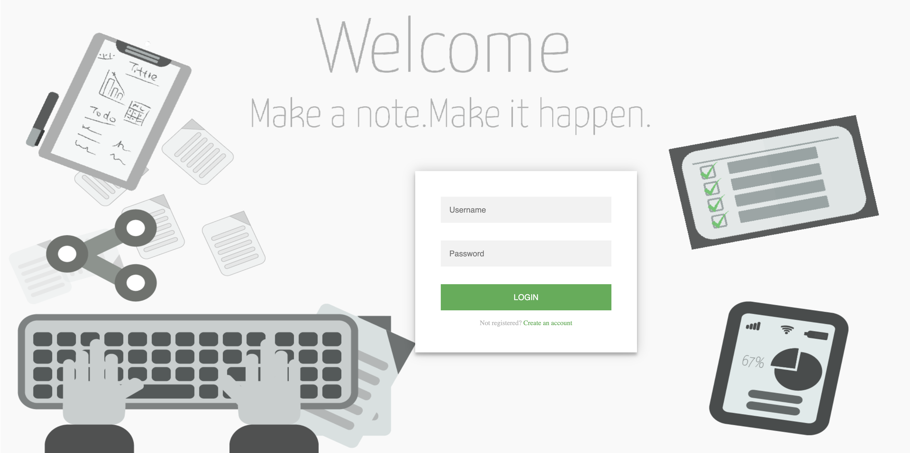
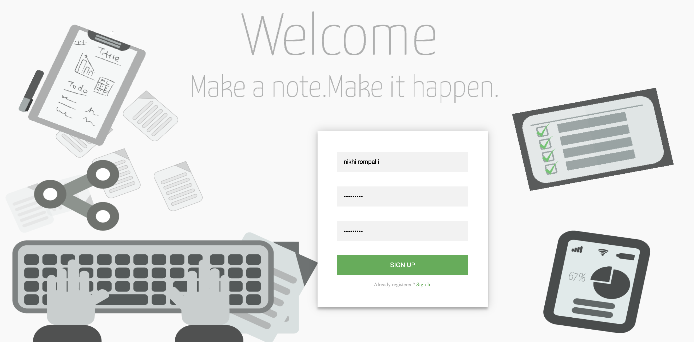
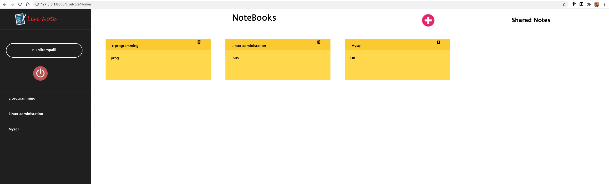
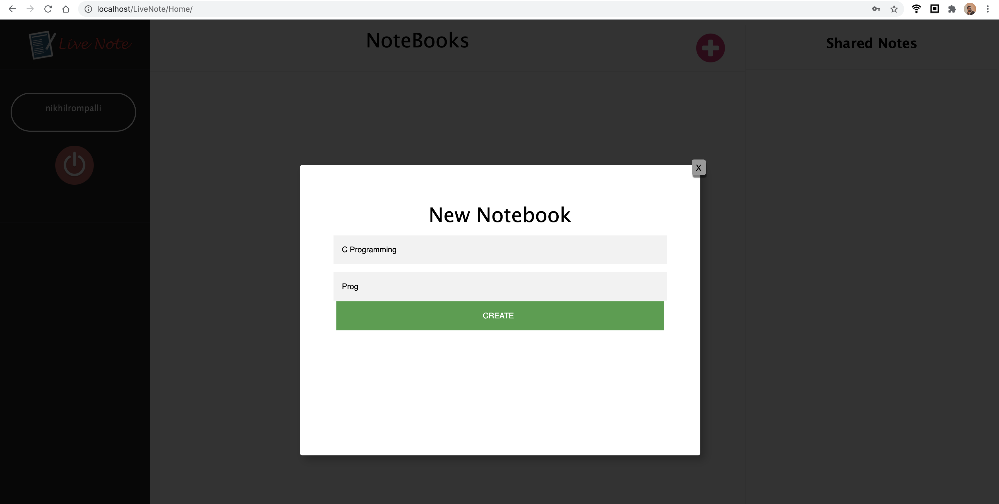
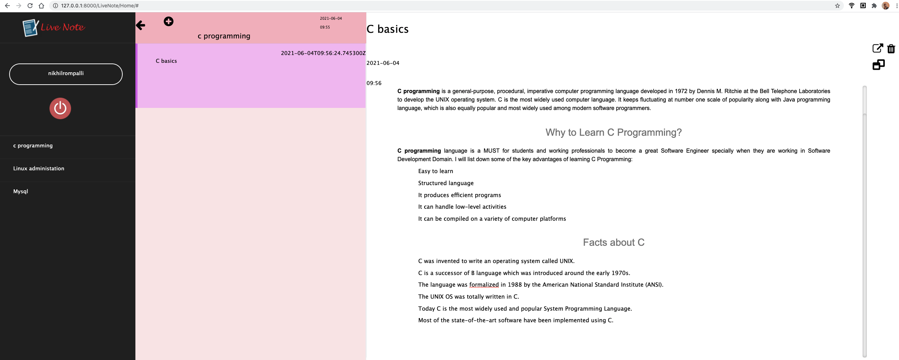
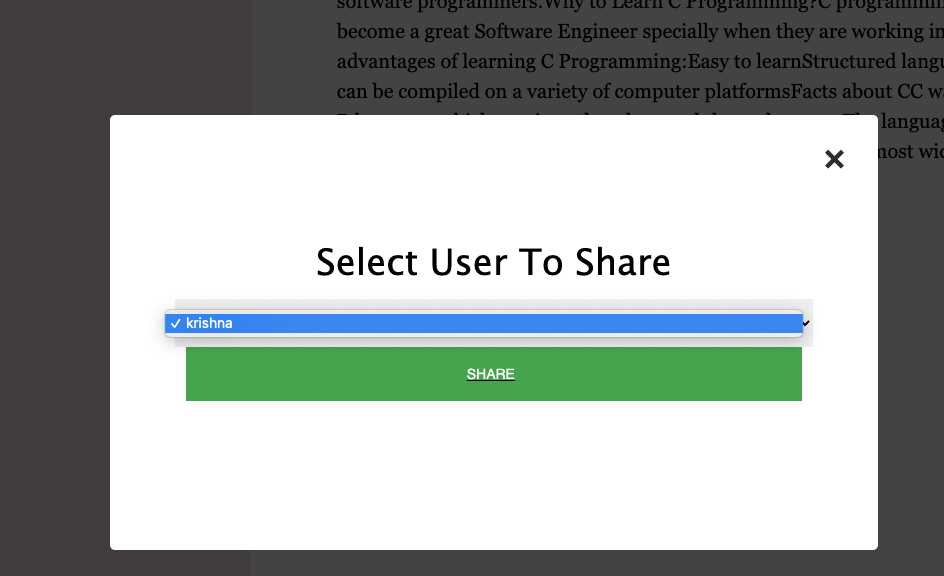
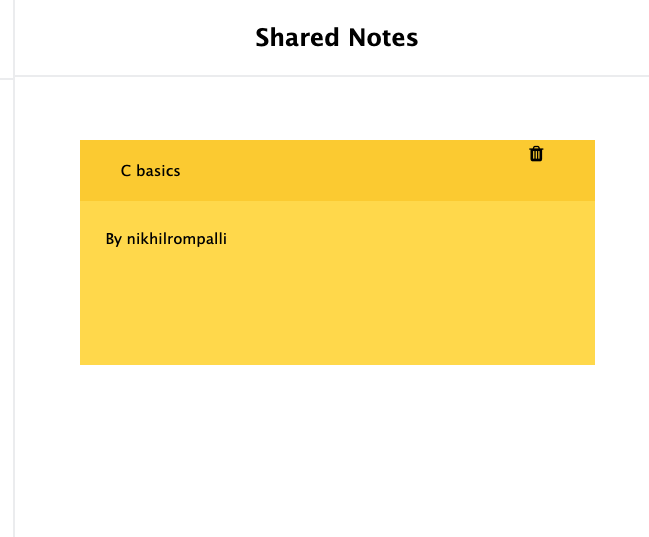

# Live Note Django Application
This is a very simple **Note Taking Application** built using Django Framework. 

1. We can add **notebooks** and delete notebooks, all the CRUD operations on the notebook. 
2. We can add **notes** to our notebooks and ,all there CRUD operations on the notes in the notebook. 
3. We can **share** the notes with other user. 

Backend : Django rest framework Database used : MySql Frontend : HTML

## Run Application
```bash
 python3 manage.py migrate
 python3 manage.py runserver 0.0.0.0:8000
```
Application will be available at `http://127.0.0.1:8000`

## Flow
### LogIn


### SignUP


### Home Page


### Create NoteBook


### Create Notes


### Share Notes


### Shared Notes

